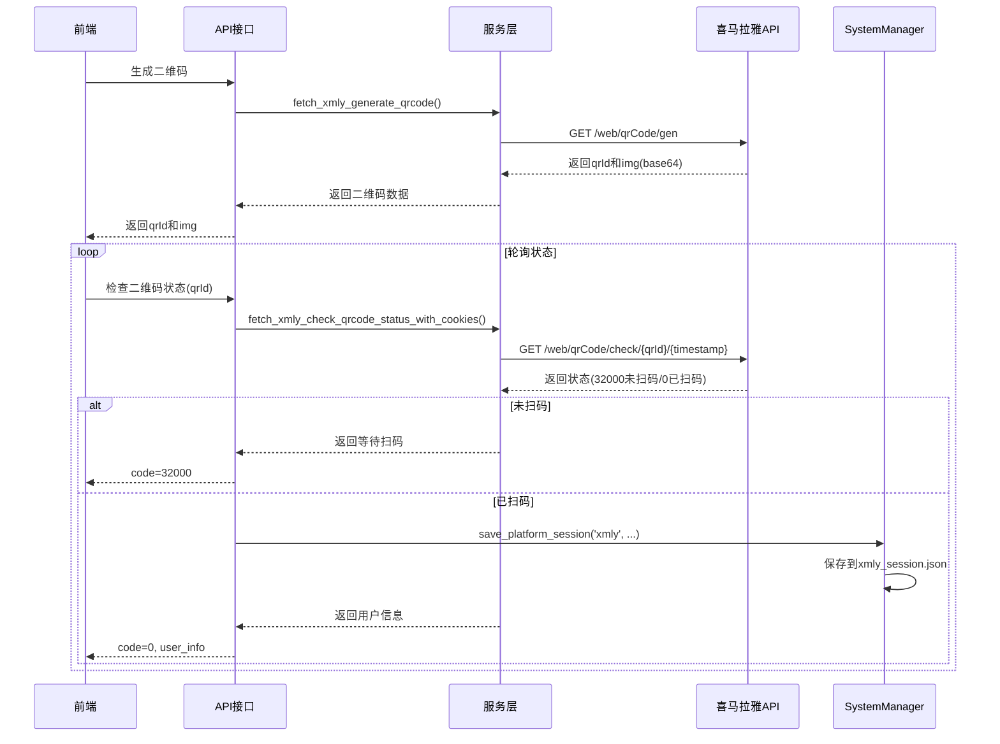

# 喜马拉雅听书功能实现文档

## 概述

本文档描述了喜马拉雅听书二维码登录功能的实现，包括数据模型、服务层、API接口以及会话管理机制。

---

## 一、功能架构

### 1.1 系统架构图

```
┌─────────────┐         ┌──────────────┐         ┌─────────────┐
│   前端      │         │   API层     │         │  服务层     │
│  (Vue)      │────────▶│  (FastAPI)  │────────▶│  (xmly.py) │
└─────────────┘         └──────────────┘         └─────────────┘
                                                          │
                                                          ▼
                                                   ┌──────────────┐
                                                   │ 喜马拉雅API   │
                                                   │  (External)   │
                                                   └──────────────┘
                                                          │
                                                          ▼
                                                   ┌──────────────┐
                                                   │ SystemManager │
                                                   │ (会话管理)    │
                                                   └──────────────┘
```

### 1.2 数据流图



---

## 二、数据模型层

### 2.1 文件位置
`app/schemas/xmly_data.py`

### 2.2 数据模型定义

#### XmlyQrcodeResponse
喜马拉雅二维码生成响应模型

```python
class XmlyQrcodeResponse(BaseModel):
    ret: int                     # 返回码，0表示成功
    msg: str                     # 返回消息
    qrId: str                    # 二维码ID，用于后续状态查询
    img: str                     # base64编码的二维码图片
```

#### XmlyQrcodeStatusResponse
喜马拉雅二维码状态查询响应模型

```python
class XmlyQrcodeStatusResponse(BaseModel):
    ret: int                     # 返回码，32000未扫码，0扫码成功
    msg: str                     # 返回消息
    uid: Optional[int]           # 用户ID
    token: Optional[str]         # 用户令牌
    mobileMask: Optional[str]     # 手机号掩码，如188****0615
    mobileCipher: Optional[str]   # 手机号加密串
    avatar: Optional[str]         # 头像URL
    loginType: Optional[str]      # 登录类型
    # ... 其他字段
```

#### XmlyUserInfo
喜马拉雅用户信息模型

```python
class XmlyUserInfo(BaseModel):
    uid: int                    # 用户ID
    mobileMask: str              # 手机号掩码
    token: Optional[str]          # 用户令牌
    avatar: Optional[str]         # 头像URL
    loginType: Optional[str]      # 登录类型
```

#### XmlyLoginStatusResponse
喜马拉雅登录状态响应模型

```python
class XmlyLoginStatusResponse(BaseModel):
    is_logged_in: bool           # 是否已登录
    user_info: Optional[XmlyUserInfo]  # 用户信息，未登录时为None
```

---

## 三、服务层

### 3.1 文件位置
`app/services/xmly.py`

### 3.2 核心函数

#### fetch_xmly_generate_qrcode()
**功能**: 生成喜马拉雅登录二维码

**API接口**:
```
GET https://passport.ximalaya.com/web/qrCode/gen?level=L&source=喜马拉雅网页端
```

**返回示例**:
```json
{
    "ret": 0,
    "msg": "操作成功",
    "qrId": "E2203A5BC5724807911EE791103511EC",
    "img": "iVBORw0KGgoAAAANSUhEUgAAAaIAAAGiCAIAAAAqaVU4AAAN80l..."
}
```

**使用示例**:
```python
qrcode_response = await fetch_xmly_generate_qrcode()
print(f"二维码ID: {qrcode_response.qrId}")
print(f"二维码图片: {qrcode_response.img}")
```

---

#### fetch_xmly_check_qrcode_status_with_cookies(qrId: str)
**功能**: 检查喜马拉雅二维码状态

**API接口**:
```
GET https://passport.ximalaya.com/web/qrCode/check/{qrId}/{timestamp}
```

**参数说明**:
- `qrId`: 二维码ID
- `timestamp`: 当前时间戳（毫秒）

**返回示例（未扫码）**:
```json
{
    "ret": 32000,
    "msg": ""
}
```

**返回示例（已扫码）**:
```json
{
    "ret": 0,
    "msg": "操作成功",
    "bizKey": null,
    "uid": 187981619,
    "token": null,
    "userType": null,
    "isFirst": false,
    "toSetPwd": true,
    "loginType": "qrcode_qrcode",
    "mobileMask": "188****0615",
    "mobileCipher": "10-EC57CB77FB64375ed3bcaa32015d4b4a274c7f276774250cb201c1353b1d1a3f3afd093a",
    "avatar": null
}
```

**响应Cookies**:
```
1&remember_me=y; Max-Age=2147483647; Expires=Mon, 01-Feb-2094 07:30:20 GMT; Domain=ximalaya.com; Path=/
1&_token=187981619&98549F30240NA66C07143B5BA04DE2EAC11B5EE55655F4DE49130218C1DE3537BF60613AA95B213M97B60DD73399214_; Max-Age=2147483647; Expires=Mon, 01-Feb-2094 07:30:20 GMT; Domain=ximalaya.com; Path=/; HttpOnly
1_l_flag=187981619&98549F30240NA66C07143B5BA04DE2EAC11B5EE55655F4DE49130218C1DE3537BF60613AA95B213M97B60DD73399214__2026-01-1412:16:13; Domain=ximalaya.com; Path=/
```

**使用示例**:
```python
result = await fetch_xmly_check_qrcode_status_with_cookies(qrId)
status_data = result['status_data']
cookies = result['cookies']

if status_data['ret'] == 0:
    print(f"扫码成功，用户ID: {status_data['uid']}")
    print(f"手机号: {status_data['mobileMask']}")
else:
    print("等待扫码...")
```

---

#### save_xmly_session(status_data, cookies)
**功能**: 保存喜马拉雅登录会话

**保存位置**: `sessions/xmly_session.json`

**保存格式**:
```json
{
    "user_info": {
        "uid": 187981619,
        "mobileMask": "188****0615",
        "token": "...",
        "avatar": null,
        "loginType": "qrcode_qrcode"
    },
    "cookies": {
        "1&remember_me": "y",
        "1&_token": "...",
        "1_l_flag": "..."
    },
    "token": "",
    "created_at": "2026-01-14T12:16:13.123456",
    "expires_at": "2026-01-21T12:16:13.123456"
}
```

---

#### load_xmly_session()
**功能**: 加载喜马拉雅登录会话

**返回**: 会话数据字典（包含user_info、cookies、token）或None

**特性**:
- 自动检查会话是否过期
- 会话过期自动删除

---

#### clear_xmly_session()
**功能**: 清除喜马拉雅登录会话

**操作**: 删除`sessions/xmly_session.json`文件

---

#### get_xmly_login_status()
**功能**: 获取喜马拉雅登录状态

**返回**: `XmlyLoginStatusResponse`对象

---

#### decode_qrcode_image(img_base64: str)
**功能**: 解码base64编码的二维码图片

**参数**: base64编码的图片字符串

**返回**: 二进制图片数据（bytes）

---

## 四、核心管理层

### 4.1 文件位置
`app/services/system.py`

### 4.2 SystemManager扩展方法

为了支持多平台会话管理，SystemManager新增了以下方法：

#### save_platform_session(platform, user_info, cookies, token, expires_days)
**功能**: 保存指定平台的用户会话

**参数**:
- `platform`: 平台标识（如 'xmly', 'wx' 等）
- `user_info`: 用户信息字典
- `cookies`: 用户cookies字典（可选）
- `token`: 用户token字符串（可选）
- `expires_days`: 过期天数，默认7天

**文件命名规则**: `{platform}_session.json`

**示例**:
```python
system_manager.save_platform_session(
    platform='xmly',
    user_info={'uid': 187981619, 'mobileMask': '188****0615'},
    cookies={'key': 'value'},
    token='xxx',
    expires_days=7
)
```

---

#### load_platform_session(platform)
**功能**: 加载指定平台的用户会话

**参数**: 平台标识（如 'xmly', 'wx' 等）

**返回**: 会话数据字典或None

**特性**:
- 自动检查会话是否过期
- 会话过期自动删除

**示例**:
```python
session = system_manager.load_platform_session('xmly')
if session:
    print(f"用户ID: {session['user_info']['uid']}")
```

---

#### clear_platform_session(platform)
**功能**: 清除指定平台的用户会话

**参数**: 平台标识（如 'xmly', 'wx' 等）

**返回**: 是否清除成功

**示例**:
```python
system_manager.clear_platform_session('xmly')
```

---

#### is_platform_logged_in(platform)
**功能**: 检查指定平台是否已登录

**参数**: 平台标识（如 'xmly', 'wx' 等）

**返回**: 是否已登录

**示例**:
```python
if system_manager.is_platform_logged_in('xmly'):
    print("喜马拉雅已登录")
```

---

### 4.3 向后兼容性

原有的方法保持不变，继续支持微信公众号会话管理：

- `save_session()` - 保存到 `user_session.json`
- `load_session()` - 从 `user_session.json` 加载
- `clear_session()` - 清除 `user_session.json`
- `is_logged_in()` - 检查是否已登录

---

## 五、API接口层

### 5.1 文件位置
`app/api/endpoints/xmly.py`

### 5.2 接口列表

#### 1. 生成二维码
**接口**: `POST /xmly/login/generate-qrcode`

**描述**: 生成喜马拉雅登录二维码

**请求**: 无需参数

**响应**:
```json
{
    "code": 0,
    "msg": "success",
    "data": {
        "qrId": "E2203A5BC5724807911EE791103511EC",
        "img": "iVBORw0KGgoAAAANSUhEUgAAAaIAAAGiCAIAAAAqaVU4AAAN80l..."
    }
}
```

**使用示例**:
```javascript
const response = await fetch('/xmly/login/generate-qrcode', {
    method: 'POST'
});
const data = await response.json();
const qrId = data.data.qrId;
const img = data.data.img; // base64编码的图片
```

---

#### 2. 检查二维码状态
**接口**: `POST /xmly/login/check-qrcode-status`

**描述**: 检查喜马拉雅二维码状态（轮询接口）

**请求**:
```json
{
    "qrId": "E2203A5BC5724807911EE791103511EC"
}
```

**响应（未扫码）**:
```json
{
    "code": 32000,
    "msg": "等待扫码",
    "data": {
        "scanned": false,
        "user_info": null
    }
}
```

**响应（已扫码）**:
```json
{
    "code": 0,
    "msg": "登录成功",
    "data": {
        "scanned": true,
        "user_info": {
            "uid": 187981619,
            "mobileMask": "188****0615",
            "token": "...",
            "avatar": null,
            "loginType": "qrcode_qrcode"
        }
    }
}
```

**使用示例**:
```javascript
// 前端轮询示例
const pollQrcodeStatus = async (qrId) => {
    const maxRetries = 60; // 最多轮询60次（1分钟）
    let retries = 0;

    const interval = setInterval(async () => {
        retries++;
        if (retries > maxRetries) {
            clearInterval(interval);
            alert('二维码已过期，请重新生成');
            return;
        }

        const response = await fetch('/xmly/login/check-qrcode-status', {
            method: 'POST',
            headers: { 'Content-Type': 'application/json' },
            body: JSON.stringify({ qrId })
        });

        const data = await response.json();

        if (data.code === 0) {
            // 扫码成功
            clearInterval(interval);
            alert('登录成功！');
            console.log('用户信息:', data.data.user_info);
        }
    }, 1000); // 每秒轮询一次
};

// 使用示例
pollQrcodeStatus('E2203A5BC5724807911EE791103511EC');
```

---

#### 3. 获取登录状态
**接口**: `GET /xmly/login/get-session`

**描述**: 获取喜马拉雅当前登录状态

**请求**: 无需参数

**响应（未登录）**:
```json
{
    "code": 0,
    "msg": "success",
    "data": {
        "is_logged_in": false,
        "user_info": null
    }
}
```

**响应（已登录）**:
```json
{
    "code": 0,
    "msg": "success",
    "data": {
        "is_logged_in": true,
        "user_info": {
            "uid": 187981619,
            "mobileMask": "188****0615",
            "token": "...",
            "avatar": null,
            "loginType": "qrcode_qrcode"
        }
    }
}
```

**使用示例**:
```javascript
const response = await fetch('/xmly/login/get-session');
const data = await response.json();

if (data.data.is_logged_in) {
    console.log('已登录用户:', data.data.user_info);
} else {
    console.log('未登录');
}
```

---

#### 4. 退出登录
**接口**: `DELETE /xmly/login/logout`

**描述**: 退出喜马拉雅登录，清除本地会话

**请求**: 无需参数

**响应**:
```json
{
    "code": 0,
    "msg": "登出成功",
    "data": null
}
```

**使用示例**:
```javascript
const response = await fetch('/xmly/login/logout', {
    method: 'DELETE'
});
const data = await response.json();
console.log(data.msg); // "登出成功"
```

---

#### 5. 获取二维码图片
**接口**: `GET /xmly/login/qrcode-image`

**描述**: 直接返回二维码图片（PNG格式）

**请求**: 无需参数

**响应**: PNG图片二进制数据

**Content-Type**: `image/png`

**使用示例**:
```javascript
// 直接在img标签中使用


// 或通过fetch获取
const response = await fetch('/xmly/login/qrcode-image');
const blob = await response.blob();
const imageUrl = URL.createObjectURL(blob);
document.getElementById('qrcode-img').src = imageUrl;
```

---

## 六、前端集成示例

### 6.1 Vue组件示例

```vue
<template>
  <div class="xmly-login">
    <!-- 未登录状态 -->
    <div v-if="!isLoggedIn" class="login-container">
      <h2>喜马拉雅登录</h2>

      <!-- 显示二维码 -->
      <div v-if="qrcodeData" class="qrcode-container">
        
        <p>请使用喜马拉雅App扫码登录</p>
        <p class="status">{{ qrcodeStatus }}</p>
      </div>

      <!-- 生成二维码按钮 -->
      <button v-else @click="generateQrcode" class="btn-primary">
        生成登录二维码
      </button>
    </div>

    <!-- 已登录状态 -->
    <div v-else class="logged-in-container">
      <h2>已登录</h2>
      <div class="user-info">
        <p>用户ID: {{ userInfo.uid }}</p>
        <p>手机号: {{ userInfo.mobileMask }}</p>
      </div>
      <button @click="logout" class="btn-danger">退出登录</button>
    </div>
  </div>
</template>

<script setup>
import { ref, onMounted } from 'vue';
import axios from 'axios';

const qrcodeData = ref(null);
const qrcodeStatus = ref('');
const isLoggedIn = ref(false);
const userInfo = ref(null);
let pollTimer = null;

// 生成二维码
const generateQrcode = async () => {
  try {
    const response = await axios.post('/xmly/login/generate-qrcode');
    qrcodeData.value = response.data.data;
    startPolling(response.data.data.qrId);
  } catch (error) {
    console.error('生成二维码失败:', error);
    alert('生成二维码失败');
  }
};

// 开始轮询二维码状态
const startPolling = (qrId) => {
  qrcodeStatus.value = '等待扫码...';
  let retries = 0;
  const maxRetries = 60;

  pollTimer = setInterval(async () => {
    retries++;
    if (retries > maxRetries) {
      clearInterval(pollTimer);
      qrcodeStatus.value = '二维码已过期，请重新生成';
      return;
    }

    try {
      const response = await axios.post('/xmly/login/check-qrcode-status', {
        qrId
      });

      if (response.data.code === 0) {
        // 扫码成功
        clearInterval(pollTimer);
        qrcodeStatus.value = '登录成功！';
        userInfo.value = response.data.data.user_info;
        isLoggedIn.value = true;
      }
    } catch (error) {
      console.error('检查状态失败:', error);
    }
  }, 1000);
};

// 获取登录状态
const checkLoginStatus = async () => {
  try {
    const response = await axios.get('/xmly/login/get-session');
    isLoggedIn.value = response.data.data.is_logged_in;
    if (isLoggedIn.value) {
      userInfo.value = response.data.data.user_info;
    }
  } catch (error) {
    console.error('获取登录状态失败:', error);
  }
};

// 退出登录
const logout = async () => {
  try {
    await axios.delete('/xmly/login/logout');
    isLoggedIn.value = false;
    userInfo.value = null;
    qrcodeData.value = null;
  } catch (error) {
    console.error('退出登录失败:', error);
    alert('退出登录失败');
  }
};

onMounted(() => {
  checkLoginStatus();
});
</script>

<style scoped>
.xmly-login {
  max-width: 500px;
  margin: 0 auto;
  padding: 20px;
}

.qrcode-container {
  text-align: center;
  padding: 20px;
  border: 1px solid #e0e0e0;
  border-radius: 8px;
}

.qrcode-container img {
  width: 200px;
  height: 200px;
}

.status {
  color: #666;
  margin-top: 10px;
}

.user-info {
  margin: 20px 0;
  padding: 15px;
  background-color: #f5f5f5;
  border-radius: 8px;
}

.btn-primary {
  background-color: #ff6900;
  color: white;
  border: none;
  padding: 10px 20px;
  border-radius: 4px;
  cursor: pointer;
}

.btn-danger {
  background-color: #f44336;
  color: white;
  border: none;
  padding: 10px 20px;
  border-radius: 4px;
  cursor: pointer;
}
</style>
```

---

## 七、测试指南

### 7.1 测试用例

#### 测试用例1：生成二维码
**步骤**:
1. 调用 `POST /xmly/login/generate-qrcode`
2. 验证响应中包含 `qrId` 和 `img`
3. 验证 `img` 可以正确解码为二维码图片

**预期结果**:
```json
{
    "code": 0,
    "msg": "success",
    "data": {
        "qrId": "xxx",
        "img": "iVBORw..."
    }
}
```

---

#### 测试用例2：检查二维码状态（未扫码）
**步骤**:
1. 调用 `POST /xmly/login/generate-qrcode` 获取 `qrId`
2. 调用 `POST /xmly/login/check-qrcode-status` 传入 `qrId`
3. 验证返回状态码为 32000

**预期结果**:
```json
{
    "code": 32000,
    "msg": "等待扫码",
    "data": {
        "scanned": false,
        "user_info": null
    }
}
```

---

#### 测试用例3：扫码登录
**步骤**:
1. 调用 `POST /xmly/login/generate-qrcode` 获取二维码
2. 使用喜马拉雅App扫码
3. 轮询调用 `POST /xmly/login/check-qrcode-status`
4. 验证返回 `code=0` 和用户信息
5. 检查 `sessions/xmly_session.json` 文件已创建

**预期结果**:
```json
{
    "code": 0,
    "msg": "登录成功",
    "data": {
        "scanned": true,
        "user_info": {
            "uid": 187981619,
            "mobileMask": "188****0615",
            "token": "...",
            "avatar": null,
            "loginType": "qrcode_qrcode"
        }
    }
}
```

---

#### 测试用例4：获取登录状态
**步骤**:
1. 确保已登录
2. 调用 `GET /xmly/login/get-session`
3. 验证返回 `is_logged_in=true` 和用户信息

**预期结果**:
```json
{
    "code": 0,
    "msg": "success",
    "data": {
        "is_logged_in": true,
        "user_info": {
            "uid": 187981619,
            "mobileMask": "188****0615"
        }
    }
}
```

---

#### 测试用例5：退出登录
**步骤**:
1. 确保已登录
2. 调用 `DELETE /xmly/login/logout`
3. 调用 `GET /xmly/login/get-session`
4. 验证返回 `is_logged_in=false`
5. 检查 `sessions/xmly_session.json` 文件已删除

**预期结果**:
```json
{
    "code": 0,
    "msg": "登出成功",
    "data": null
}
```

---

#### 测试用例6：会话过期
**步骤**:
1. 登录后手动修改 `sessions/xmly_session.json` 中的 `expires_at` 为过去时间
2. 调用 `GET /xmly/login/get-session`
3. 验证返回 `is_logged_in=false`
4. 检查 `sessions/xmly_session.json` 文件已删除

**预期结果**:
```json
{
    "code": 0,
    "msg": "success",
    "data": {
        "is_logged_in": false,
        "user_info": null
    }
}
```

---

### 7.2 使用curl测试

```bash
# 1. 生成二维码
curl -X POST http://localhost:8000/xmly/login/generate-qrcode

# 2. 检查二维码状态（替换qrId）
curl -X POST http://localhost:8000/xmly/login/check-qrcode-status \
  -H "Content-Type: application/json" \
  -d '{"qrId":"E2203A5BC5724807911EE791103511EC"}'

# 3. 获取登录状态
curl http://localhost:8000/xmly/login/get-session

# 4. 退出登录
curl -X DELETE http://localhost:8000/xmly/login/logout

# 5. 获取二维码图片（直接返回PNG）
curl -o qrcode.png http://localhost:8000/xmly/login/qrcode-image
```

---

## 八、注意事项

### 8.1 会话管理
- 会话文件保存在 `sessions` 目录下
- 默认过期时间为7天
- 会话过期后自动删除
- 支持多平台独立会话（wx、xmly等）

### 8.2 Cookie处理
- 喜马拉雅的Cookie包含多个字段（`1&remember_me`、`1&_token`、`1_l_flag`等）
- Cookie有效期很长（Max-Age=2147483647，约68年）
- 部分Cookie设置了HttpOnly标志

### 8.3 错误处理
- 所有接口统一返回格式：`{code, msg, data}`
- 异常情况会记录日志并返回适当的错误信息
- 建议前端根据 `code` 字段判断结果

### 8.4 安全性
- 二维码有效期约60秒
- 会话数据存储在本地JSON文件中
- 生产环境建议加密存储敏感信息
- 定期清理过期的会话文件

### 8.5 扩展性
- SystemManager支持任意平台的会话管理
- 只需使用 `save_platform_session()`、`load_platform_session()` 等方法
- 新增平台只需指定platform参数（如 'bilibili'、'douyin' 等）

---

## 九、常见问题

### Q1: 二维码生成失败怎么办？
A: 检查网络连接，确认可以访问喜马拉雅API。查看日志获取详细错误信息。

### Q2: 轮询接口一直返回32000？
A: 说明用户还未扫码，继续轮询。建议设置最大轮询次数（如60次）。

### Q3: 扫码成功但会话未保存？
A: 检查 `sessions` 目录是否有写入权限，查看日志获取详细错误信息。

### Q4: 会话过期时间如何设置？
A: 调用 `save_platform_session()` 时传入 `expires_days` 参数，默认为7天。

### Q5: 如何支持其他平台？
A: 使用 `system_manager.save_platform_session('platform_name', ...)` 即可，SystemManager会自动创建对应的会话文件。

---

## 十、更新日志

### v1.0.0 (2026-01-14)
- 初始版本
- 实现喜马拉雅二维码登录功能
- 实现多平台会话管理
- 实现登录状态查询
- 实现退出登录功能
- 完善错误处理和日志记录

---

## 十一、相关文件清单

```
app/
├── api/
│   ├── endpoints/
│   │   └── xmly.py                  # 喜马拉雅API接口
│   └── api.py                       # 路由注册（已更新）
├── schemas/
│   └── xmly_data.py                 # 喜马拉雅数据模型
├── services/
│   ├── xmly.py                      # 喜马拉雅服务层
│   └── system.py                    # SystemManager扩展（已更新）
└── api/
    └── 喜马拉雅功能爬虫.md            # 本文档
```

---

## 十二、联系方式

如有问题或建议，请联系开发团队。
