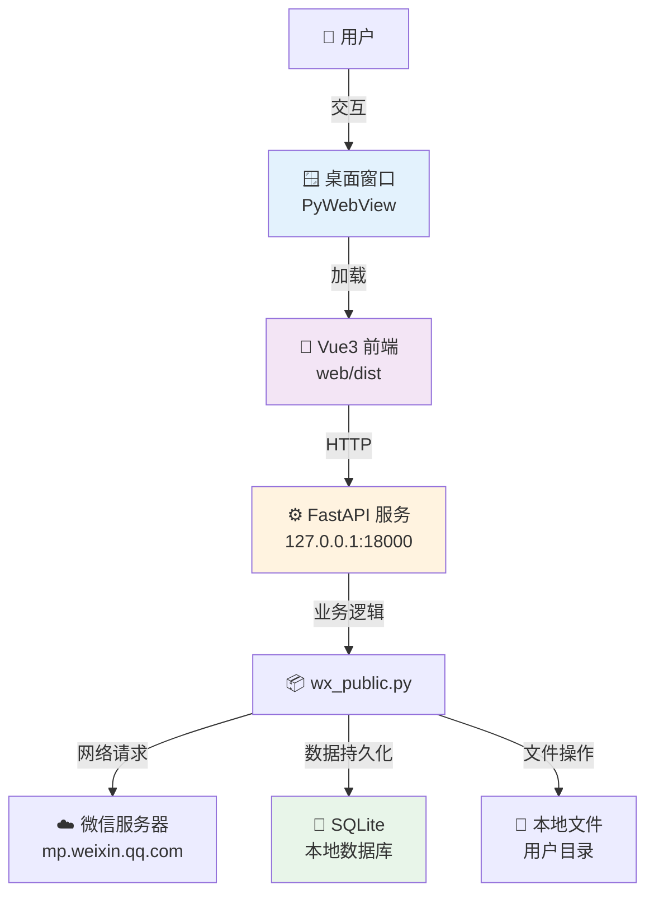
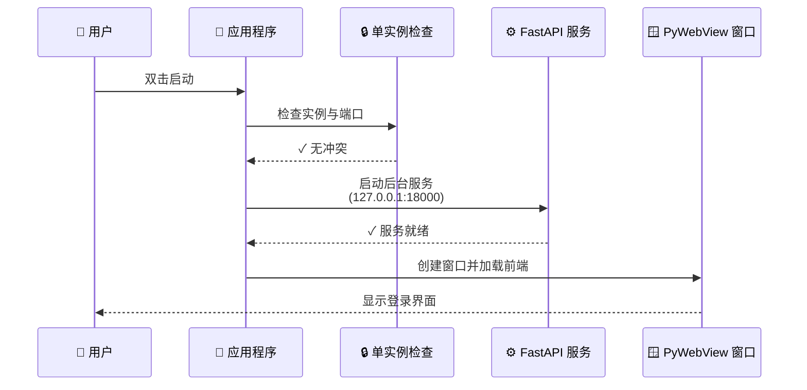

# 公众号爬虫桌面端程序 - 实施方案与使用指南

> **状态**: ✅ 已完成并投入使用  
> **最后更新**: 2025-12-22  
> **版本**: v1.0

## 1. 项目概述

将 "微信公众号爬虫（基于微信官方接口）" 封装为独立的桌面可执行程序（.exe/.app），提供原生桌面应用体验。

### 1.1 核心功能
- ✅ 扫码登录微信公众号平台
- ✅ 搜索并浏览公众号
- ✅ 查看文章列表（分页加载）
- ✅ 查看文章详情并下载保存
- ✅ 本地化存储（SQLite）
- ✅ 跨平台支持（macOS/Windows）

### 1.2 应用特点
- 🚀 **独立运行**：无需安装 Python 环境
- 💾 **轻量存储**：使用 SQLite，数据保存在用户目录
- 🔒 **单实例运行**：防止多开，避免端口冲突
- 📊 **完整日志**：所有操作可追溯
- 🎨 **现代界面**：基于 Vue 3 的响应式设计

## 2. 技术架构

采用 **B/S 混合架构**（Browser/Server），结合 Python 后端能力和 Web 前端交互体验。

### 2.1 技术栈

| 层级 | 技术 | 说明 |
|------|------|------|
| **前端** | Vue 3 + TypeScript | 响应式 UI，类型安全 |
| **样式** | TailwindCSS + UnoCSS | 原子化 CSS，快速开发 |
| **后端** | Python 3.9+ + FastAPI | 高性能异步框架 |
| **数据库** | SQLite | 轻量级，无需单独安装 |
| **容器** | PyWebView | 轻量级 Webview 容器 |
| **打包** | PyInstaller | 生成独立可执行文件 |

### 2.2 架构优势

**相比 Electron 的优势**：
- ✅ **体积更小**：约 50MB vs Electron 的 150MB+
- ✅ **资源占用低**：使用系统 WebView，不打包浏览器引擎
- ✅ **启动更快**：无需加载完整 Chromium
- ✅ **Python 生态**：直接使用丰富的 Python 库

### 2.3 架构图



### 2.4 数据流转

```
用户操作 → 前端事件 → API 请求 → 后端处理 → 返回数据 → UI 更新
                ↓
            微信服务器
                ↓
          SQLite 持久化
```

## 3. 运行流程

### 3.1 启动流程（已实现）



**详细步骤**：

1. **环境检查** (5秒内完成)
   - 设置环境变量：`ENV=desktop`, `DB_DRIVER=sqlite`
   - 检查单实例锁文件（`~/Library/Application Support/WxPublicCrawler/app.lock`）
   - 检查端口 18000 可用性
   - 初始化 SQLite 数据库

2. **后端启动** (线程模式)
   - 启动 Uvicorn 监听 127.0.0.1:18000
   - 挂载静态文件（`/crawl-desktop/` → `web/dist/`）
   - 加载 FastAPI 路由和中间件

3. **前端加载** (窗口创建)
   - 使用 PyWebView 创建窗口（800x600，可调整）
   - 加载 `http://127.0.0.1:18000/crawl-desktop/`
   - 显示登录页面

### 3.2 业务流程（已实现）

#### 阶段 1: 微信登录

```
用户打开应用
    ↓
显示二维码（API: /api/v1/wx/public/login/get-wx-login-qrcode）
    ↓
用户扫码确认
    ↓
轮询状态（API: /api/v1/wx/public/login/get-qrcode-status）
    ↓
登录成功 → 保存 Cookies → 跳转搜索页
```

**关键 API**：
- `POST /api/v1/wx/public/login/prelogin` - 预登录
- `POST /api/v1/wx/public/login/startlogin` - 开始登录
- `GET /api/v1/wx/public/login/get-wx-login-qrcode` - 获取二维码
- `POST /api/v1/wx/public/login/get-qrcode-status` - 查询状态

#### 阶段 2: 搜索公众号

```
输入公众号名称
    ↓
调用搜索 API
    ↓
展示搜索结果（头像、名称、描述）
    ↓
选择目标公众号 → 记录 fakeid → 跳转文章列表
```

**关键 API**：
- `GET /api/v1/wx/public/search-wx-public?query=名称&begin=0&count=10`

#### 阶段 3: 浏览与下载文章

```
查看文章列表（分页）
    ↓
选择文章
    ↓
查看详情 / 下载
    ↓
保存到本地
    ├─ HTML 文件
    ├─ 图片资源
    └─ 元数据记录到 SQLite
```

**关键 API**：
- `POST /api/v1/wx/public/get-wx-article-list` - 文章列表
- `POST /api/v1/wx/public/get-wx-article-detail-by-link` - 文章详情

**文件保存位置**：
- macOS: `~/Library/Application Support/WxPublicCrawler/`
- Windows: `~/AppData/Local/WxPublicCrawler/`

## 4. 实现状态（已完成）

### ✅ 任务组 A: 后端适配

| 任务 | 状态 | 实现位置 |
|------|------|---------|
| 静态资源服务 | ✅ 完成 | `app/main.py` - 挂载 `/crawl-desktop/` |
| 桌面入口脚本 | ✅ 完成 | `run_desktop.py` - 主入口 |
| SQLite 适配 | ✅ 完成 | `app/config/database_config.py` |
| 文件系统处理 | ✅ 完成 | `app/utils/src_path.py` - 可写目录 |
| 环境配置 | ✅ 完成 | `app/core/config.py` - 桌面模式 |
| 单实例控制 | ✅ 完成 | `run_desktop.py` - 文件锁机制 |
| 日志系统 | ✅ 完成 | 输出到用户日志目录 |

**关键实现**：

```python
# run_desktop.py
os.environ['ENV'] = 'desktop'
os.environ['DB_DRIVER'] = 'sqlite'

# 单实例检查
from filelock import FileLock
lock = FileLock(get_lock_file_path())

# 启动服务
uvicorn.run(app, host="127.0.0.1", port=18000)

# 创建窗口
webview.create_window('公众号爬虫助手', 'http://127.0.0.1:18000/crawl-desktop/')
```

### ✅ 任务组 B: 前端开发

| 任务 | 状态 | 实现位置 |
|------|------|---------|
| Vue Router 配置 | ✅ 完成 | `web/src/router/index.ts` |
| 登录页面 | ✅ 完成 | `web/src/views/WeChatLogin.vue` |
| 搜索页面 | ✅ 完成 | `web/src/views/PublicSearch.vue` |
| 文章列表页 | ✅ 完成 | `web/src/views/ArticleList.vue` |
| API 封装 | ✅ 完成 | `web/src/services/wechatService.ts` |
| 状态管理 | ✅ 完成 | `web/src/stores/wechatLoginStore.ts` |
| 请求拦截器 | ✅ 完成 | `web/src/utils/request.ts` |

**技术细节**：
- 使用 Pinia 进行状态管理
- Axios 统一请求处理
- 支持二进制数据（二维码图片）
- 响应式设计，适配不同窗口大小

### ✅ 任务组 C: 桌面容器

| 任务 | 状态 | 说明 |
|------|------|------|
| PyWebView 集成 | ✅ 完成 | 窗口大小、标题配置 |
| 生命周期管理 | ✅ 完成 | 窗口关闭时终止服务 |
| 多进程处理 | ✅ 完成 | `multiprocessing.freeze_support()` |
| macOS 兼容性 | ✅ 完成 | `set_start_method('spawn')` |

### ✅ 任务组 D: 打包与分发

| 任务 | 状态 | 实现位置 |
|------|------|---------|
| PyInstaller 配置 | ✅ 完成 | `wx_crawler.spec` |
| macOS 打包脚本 | ✅ 完成 | `script/desktop/build_mac.sh` |
| Windows 打包脚本 | ✅ 完成 | `script/desktop/build_windows.bat` |
| 测试脚本 | ✅ 完成 | `script/desktop/test_app.sh` |
| 日志查看工具 | ✅ 完成 | `script/desktop/view_logs.sh` |
| 清理脚本 | ✅ 完成 | `script/desktop/kill_app.sh` |
| 验证工具 | ✅ 完成 | `script/desktop/verify_scripts.sh` |

**打包配置关键点**：

```python
# wx_crawler.spec
datas=[
    ('web/dist', 'web/dist'),  # 前端资源
    ('app/models', 'app/models'),  # 数据模型
],
hiddenimports=[
    'uvicorn.logging',
    'sqlalchemy.sql.default_comparator',
    'sqlite3',  # SQLite 支持
    'multiprocessing',  # 多进程支持
]
```

## 5. 实际目录结构

```
wxPublicCrawl/
├── app/                          # 后端代码
│   ├── api/                      # API 路由
│   │   ├── api.py
│   │   └── endpoints/
│   │       ├── wx_public.py      # 微信公众号接口
│   │       └── ...
│   ├── config/                   # 配置模块
│   │   └── database_config.py    # 数据库配置（支持 SQLite/MySQL）
│   ├── core/                     # 核心配置
│   │   ├── config.py             # 应用配置（支持多环境）
│   │   └── logging_uru.py        # 日志配置
│   ├── db/                       # 数据库
│   │   └── sqlalchemy_db.py      # SQLAlchemy 连接
│   ├── models/                   # 数据模型
│   │   └── article.py
│   ├── schemas/                  # Pydantic 模型
│   │   ├── wx_data.py
│   │   └── common_data.py
│   ├── services/                 # 业务逻辑
│   │   └── wx_public.py          # 微信公众号服务
│   ├── utils/                    # 工具类
│   │   ├── src_path.py           # 路径处理（桌面适配）
│   │   └── wx_article_handle.py  # 文章处理
│   └── main.py                   # FastAPI 应用入口
│
├── web/                          # 前端代码
│   ├── src/
│   │   ├── views/
│   │   │   ├── WeChatLogin.vue   # 登录页
│   │   │   ├── PublicSearch.vue  # 搜索页
│   │   │   └── ArticleList.vue   # 文章列表页
│   │   ├── router/
│   │   │   └── index.ts          # 路由配置
│   │   ├── stores/
│   │   │   └── wechatLoginStore.ts # 状态管理
│   │   ├── services/
│   │   │   └── wechatService.ts  # API 封装
│   │   └── utils/
│   │       └── request.ts        # Axios 封装
│   ├── dist/                     # 构建产物（打包时包含）
│   ├── package.json
│   └── vite.config.ts
│
├── script/                       # 脚本工具
│   └── desktop/                  # 桌面应用脚本
│       ├── build_mac.sh          # macOS 打包
│       ├── build_windows.bat     # Windows 打包
│       ├── test_app.sh           # 测试应用
│       ├── view_logs.sh          # 查看日志
│       ├── kill_app.sh           # 清理应用
│       ├── verify_scripts.sh     # 验证工具
│       ├── README.md             # 脚本说明
│       └── MIGRATION_SUMMARY.md  # 迁移总结
│
├── docs/                         # 文档
│   ├── desktop/                  # 桌面应用文档
│   │   ├── DESKTOP_APP_GUIDE.md  # 使用指南
│   │   ├── PACKAGING_QUICKSTART.md # 打包快速入门
│   │   └── FIX_*.md              # 问题修复文档
│   └── ...
│
├── dist/                         # 打包输出（生成）
│   ├── WxPublicCrawler.app       # macOS 应用包
│   └── WxPublicCrawler/          # 独立可执行文件
│       ├── _internal/            # 依赖文件
│       └── WxPublicCrawler       # 可执行文件
│
├── run_desktop.py                # ✨ 桌面应用入口
├── wx_crawler.spec               # ✨ PyInstaller 配置
├── requirements.txt              # Python 依赖
├── QUICK_REFERENCE.md            # 快速参考
└── README.md                     # 项目说明
```

### 5.1 用户数据目录

打包后的应用数据保存在系统标准位置：

**macOS**：
```
~/Library/
├── Application Support/
│   └── WxPublicCrawler/
│       ├── wxpublic.db          # SQLite 数据库
│       ├── temp/                # 临时文件
│       │   └── qrcode.png       # 登录二维码
│       └── app.lock             # 单实例锁文件
└── Logs/
    └── WxPublicCrawler/
        └── app_YYYYMMDD_HHMMSS.log  # 应用日志
```

**Windows**：
```
%USERPROFILE%/
├── AppData/
│   └── Local/
│       └── WxPublicCrawler/
│           ├── wxpublic.db      # SQLite 数据库
│           ├── temp/            # 临时文件
│           └── Logs/            # 应用日志
```

## 6. 使用指南

### 6.1 开发环境运行

```bash
# 1. 安装依赖
pip install -r requirements.txt
cd web && npm install

# 2. 构建前端
cd web && npm run build:only

# 3. 运行桌面应用
python run_desktop.py
```

### 6.2 打包应用

**macOS**：

```bash
# 方式1：使用脚本（推荐）
script/desktop/build_mac.sh

# 方式2：手动打包
cd web && npm run build:only && cd ..
pyinstaller wx_crawler.spec
```

**Windows**：

```batch
REM 方式1：使用脚本（推荐）
script\desktop\build_windows.bat

REM 方式2：手动打包
cd web && npm run build:only && cd ..
pyinstaller wx_crawler.spec
```

### 6.3 测试打包结果

```bash
# 测试可执行文件
script/desktop/test_app.sh

# 查看日志
script/desktop/view_logs.sh

# 清理应用
script/desktop/kill_app.sh
```

### 6.4 启动应用

**图形界面启动**（推荐）：

```bash
# macOS
open dist/WxPublicCrawler.app

# Windows
dist\WxPublicCrawler\WxPublicCrawler.exe
```

**终端启动**（调试用）：

```bash
# macOS/Linux
./dist/WxPublicCrawler/WxPublicCrawler

# Windows
dist\WxPublicCrawler\WxPublicCrawler.exe
```

## 7. 关键技术点

### 7.1 环境隔离

```python
# run_desktop.py 开头
os.environ['ENV'] = 'desktop'        # 桌面环境
os.environ['DB_DRIVER'] = 'sqlite'   # 使用 SQLite
```

### 7.2 单实例控制

```python
# 使用文件锁防止多开
from filelock import FileLock

lock_file = get_lock_file_path()
lock = FileLock(lock_file, timeout=0)

try:
    lock.acquire(blocking=False)
    # 启动应用...
except Timeout:
    print("应用已在运行")
    sys.exit(1)
```

### 7.3 文件系统适配

```python
# app/utils/src_path.py
def get_writable_dir(subdir='temp'):
    """获取可写目录"""
    if platform.system() == 'Darwin':  # macOS
        base = '~/Library/Application Support/WxPublicCrawler'
    elif platform.system() == 'Windows':
        base = '~/AppData/Local/WxPublicCrawler'
    else:  # Linux
        base = '~/.local/share/WxPublicCrawler'
    
    path = os.path.expanduser(base)
    os.makedirs(os.path.join(path, subdir), exist_ok=True)
    return os.path.join(path, subdir)
```

### 7.4 数据库自动创建

```python
# app/db/sqlalchemy_db.py
if driver == 'sqlite':
    # SQLite 自动创建表结构
    Base.metadata.create_all(self._engine)
```

## 8. 常见问题

### 8.1 应用无法启动

**症状**：双击 `.app` 后立即退出

**排查**：

```bash
# 1. 查看日志
script/desktop/view_logs.sh

# 2. 终端启动查看错误
./dist/WxPublicCrawler/WxPublicCrawler

# 3. 检查端口占用
lsof -ti:18000

# 4. 清理并重启
script/desktop/kill_app.sh
open dist/WxPublicCrawler.app
```

### 8.2 端口被占用

**错误**：`[Errno 48] address already in use`

**解决**：

```bash
# 终止占用进程
script/desktop/kill_app.sh

# 或手动终止
lsof -ti:18000 | xargs kill -9
```

### 8.3 数据库错误

**错误**：`NotSupportedError: Authentication plugin`

**原因**：尝试使用 MySQL 驱动

**解决**：确保 `run_desktop.py` 中设置了 `DB_DRIVER=sqlite`

### 8.4 文件写入失败

**错误**：`[Errno 30] Read-only file system`

**原因**：尝试在 `.app` 包内写入文件

**解决**：使用 `get_temp_file_path()` 或 `get_writable_dir()`

## 9. 性能指标

| 指标 | 数值 |
|------|------|
| **安装包大小** | ~50MB (macOS), ~60MB (Windows) |
| **首次启动时间** | 3-5秒 |
| **内存占用** | ~150MB |
| **CPU 占用** | 闲置 <1%, 工作 5-10% |
| **磁盘占用** | 数据库 <10MB (取决于使用量) |

## 10. 未来规划

- [ ] 支持批量下载文章
- [ ] 添加文章搜索功能
- [ ] 支持多账号管理
- [ ] 添加文章导出功能（PDF/Markdown）
- [ ] 优化二维码登录体验
- [ ] 添加自动更新功能
- [ ] 支持 Linux 打包

## 11. 相关文档

| 文档 | 说明 |
|------|------|
| [QUICK_REFERENCE.md](QUICK_REFERENCE.md) | 快速参考卡片 |
| [docs/desktop/DESKTOP_APP_GUIDE.md](docs/desktop/DESKTOP_APP_GUIDE.md) | 完整使用指南 |
| [docs/desktop/PACKAGING_QUICKSTART.md](docs/desktop/PACKAGING_QUICKSTART.md) | 打包快速入门 |
| [script/desktop/README.md](script/desktop/README.md) | 脚本使用说明 |
| [script/desktop/MIGRATION_SUMMARY.md](script/desktop/MIGRATION_SUMMARY.md) | 脚本迁移总结 |

## 12. 技术支持

- **问题反馈**：GitHub Issues
- **文档更新**：持续维护中
- **版本历史**：参见 Git 提交记录

---

**开发团队**: wxPublicCrawl Team  
**最后更新**: 2025-12-22  
**许可证**: MIT
